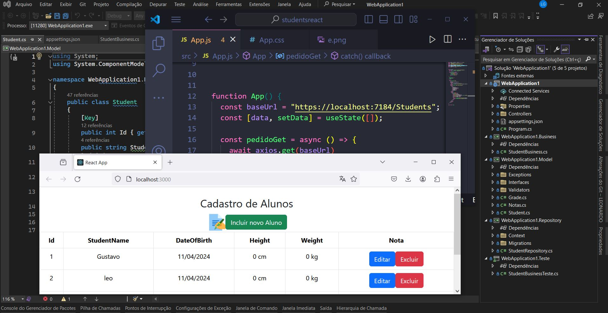

 
<h1>Aplicação de CRUD em C#, Bootstrap, e React</h1>
<h2>Descrição</h2>
Este projeto consiste em uma aplicação de CRUD desenvolvida em C#, utilizando os princípios SOLID, injeção de dependência e testes unitários para garantir a robustez do código. O objetivo é criar um sistema capaz de realizar operações de criação, leitura, atualização e exclusão de dados em um banco de dados. Para isso, foi utilizado o Bootstrap para criar uma interface de usuário moderna e responsiva, oferecendo uma experiência agradável aos usuários. Além disso, o React foi integrado para construção do frontend, aproveitando sua eficiência e facilidade de desenvolvimento.
<h2>Funcionalidades</h2>
Criação, leitura, atualização e exclusão de dados.
Interface de usuário moderna e responsiva, desenvolvida com Bootstrap.
Integração do React para construção do frontend, proporcionando uma experiência de desenvolvimento eficiente e agradável.
<h2>Tecnologias Utilizadas</h2>
C#: Linguagem de programação utilizada para o desenvolvimento do backend.
React: Biblioteca JavaScript utilizada para a construção do frontend.
Bootstrap: Framework CSS utilizado para criar uma interface de usuário moderna e responsiva.
SOLID: Princípios de design de software utilizados para garantir a manutenibilidade e extensibilidade do código.
Injeção de Dependência: Técnica utilizada para desacoplar componentes e facilitar a modularidade do sistema.
Testes Unitários: Implementados para garantir a qualidade e robustez do código.
<h2>Execução</h2>
Clone este repositório para o seu ambiente local.
Configure as conexões com o banco de dados e a API no arquivo de configuração do projeto.
Execute a aplicação.
Utilize a interface web para realizar operações de CRUD, utilizando o React para interagir com o backend.
